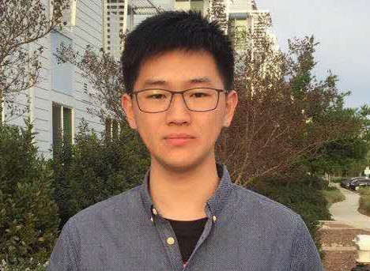

# Miao Wangqian @ NJU

<!-- <html>
    <table width="600" border="0"cellspacing="0" cellpadding="0">
        <tr>
            <td width="300">
            
            </td>
            <td width="486" valign="middle">
                <ul>
                    <li> Nanjing University, Nanjing</li>
                    <li> Kuang Yaming Honors School</li>
                    <li> 163, Xianlin Road</li>
                </ul>
            </td>
        </tr>
    </table>
</html> -->

    

---
<!-- TOC -->

- [Brief Bio](#brief-bio)
- [Interesting Projects](#interesting-projects)
- [Industry Experience](#industry-experience)
- [Coding Skills](#coding-skills)

<!-- /TOC -->

## Brief Bio

I am a student major in Physics and minor in Computer Science.
I will graduate from Nanjing University this September.

Then, I will pursue My Ph.D @ HKUST-PHY.

## Interesting Projects

- Nemu: X86 emulater
- Linux-CommandLine-Tools
  - pstree
  - cprel
  - sperf

## Industry Experience

- **Horizon Robotics**: C++ Developer Intern [2019.12 - 2019.4]

## Coding Skills

- C++ / C
- Python
- LaTeX