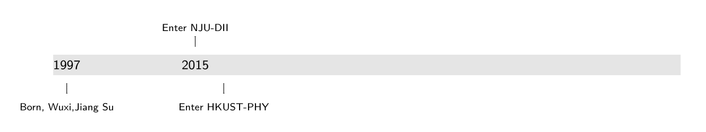
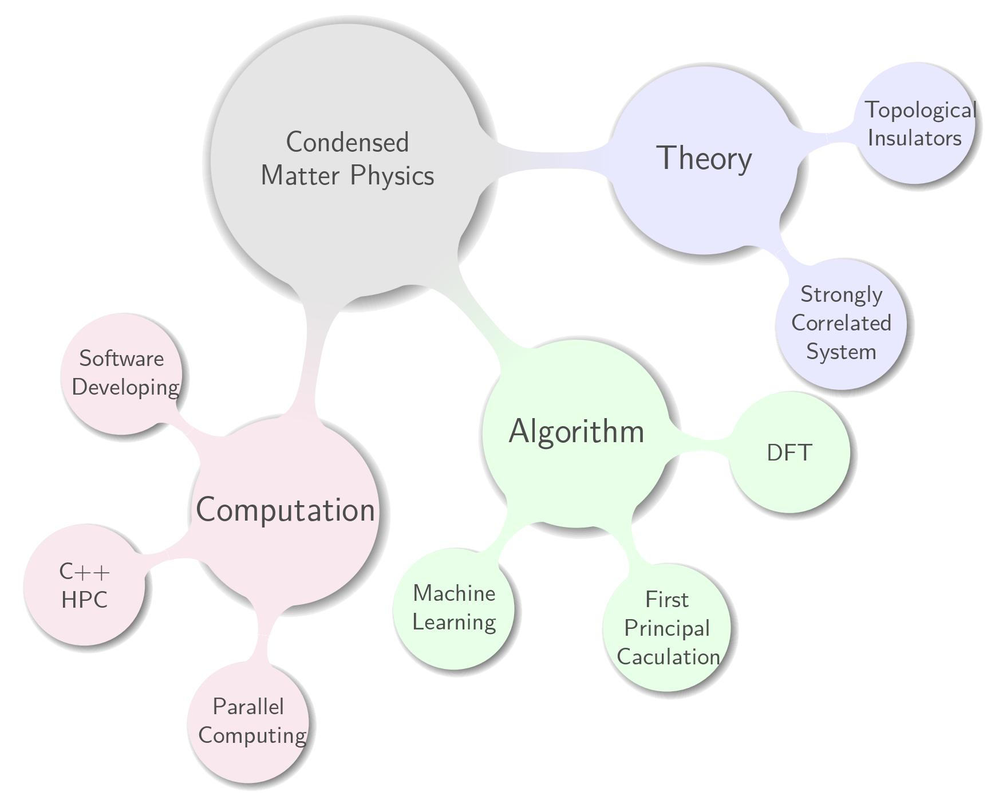

<!-- TOC -->

- [Brief Bio](#brief-bio)
- [Contact Info](#contact-info)
- [Research Focus](#research-focus)
- [Programming Projects](#programming-projects)
- [Industry Experience](#industry-experience)
- [Coding Skills](#coding-skills)

<!-- /TOC -->

## Brief Bio

---

I am a student major in Physics and minor in Computer Science.
I will graduate from [Nanjing University](https://www.nju.edu.cn/) this September.

Then, I will pursue My Ph.D @ [HKUST-PHY](http://physics.ust.hk/eng/).

Here is my TimeLine.

You can get my CV here.

<a href ="./1.pdf">Click here for the pdf file called flowers.</a>

## Contact Info

---

- 📧 (miaowangqian AT icloud DOT com)
- 🔗 [Linkedin](https://www.linkedin.com/in/王乾-缪-60826b137/)
- 🔗 [Github](https://github.com/zybbigpy/)

## Research Focus

---

## Programming Projects

---

- 💻 Nemu: X86 emulater
- 💻 Linux-CommandLine-Tools
  - pstree
  - cprel
  - sperf

## Industry Experience

---

- 👷 [Horizon Robotics](https://www.horizon.ai/) *2018.12 - 2019.4* : C++ Developer Intern

## Coding Skills

---

- C++ / C
- Python
- LaTeX